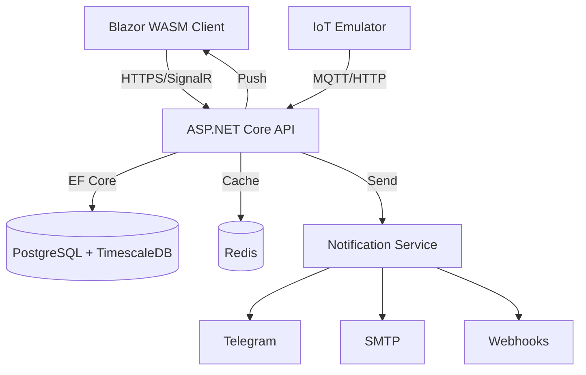

# 🌱 Greenhouse Guardian

**Система мониторинга и управления микроклиматом оранжереи**

[](https://dotnet.microsoft.com/)
[](https://dotnet.microsoft.com/apps/aspnet/web-apps/blazor)
[](https://www.postgresql.org/)
[](https://redis.io/)
[](https://www.docker.com/)
[](LICENSE)

---

## 📖 О проекте

**Greenhouse Guardian** — это полноценная IoT-платформа для автоматизации процессов в теплицах и оранжереях. Система собирает данные с датчиков (температура, влажность, освещенность, CO2), управляет исполнительными устройствами (вентиляция, полив, освещение, обогрев) и предоставляет аналитику в реальном времени.

### 🔑 Ключевые возможности
- 📊 **Real-time мониторинг**: Обновление данных каждые 2 секунды через SignalR.
- 🤖 **Автоматизация**: Гибкая система правил (If-Then) для управления климатом.
- 🚨 **Умные алерты**: Двухуровневая система предупреждений (Warning/Critical) с уведомлениями в Telegram, Email и Webhook.
- 🗺️ **Зонирование**: Разделение оранжереи на логические зоны с индивидуальными профилями растений.
- 👥 **Ролевая модель**: Разграничение прав доступа (Администратор, Агроном, Оператор, Наблюдатель).
- 📱 **Адаптивный UI**: Современный интерфейс на Blazor + MudBlazor для ПК и мобильных устройств.
- 📜 **Аудит**: Полное логирование действий пользователей и изменений конфигурации.

---

## 🏗 Архитектура

Проект построен по принципу **Clean Architecture** с разделением ответственности.



### Структура решения

| Проект | Описание |
|--------|----------|
| `GreenhouseGuardian.Domain` | Доменные сущности, интерфейсы репозиториев, события предметной области. |
| `GreenhouseGuardian.Application` | DTO, валидаторы (FluentValidation), сервисы бизнес-логики, маппинг (AutoMapper). |
| `GreenhouseGuardian.Infrastructure` | Реализация репозиториев (EF Core), контекст БД, внешние сервисы (Email, Telegram). |
| `GreenhouseGuardian.API` | Контроллеры, Hub SignalR, настройка DI, Middleware, Swagger. |
| `GreenhouseGuardian.Emulator` | Консольное приложение для генерации телеметрии от 100+ датчиков. |
| `GreenhouseGuardian.Web` | Blazor WebAssembly клиентское приложение. |

---

## 🚀 Быстрый старт

### Предварительные требования
- [.NET 8 SDK](https://dotnet.microsoft.com/download)
- [Docker Desktop](https://www.docker.com/products/docker-desktop)
- [Git](https://git-scm.com/)

### 1. Клонируйте репозиторий
```bash
git clone https://github.com/your-username/greenhouse-guardian.git
cd greenhouse-guardian
```

### 2. Запуск через Docker Compose (Рекомендуется)
Этот способ поднимет базу данных, Redis, API и эмулятор в изолированных контейнерах.

```bash
docker-compose up --build
```

После запуска:
- **Frontend**: http://localhost:5000
- **API Swagger**: http://localhost:5001/swagger
- **База данных**: localhost:5432

### 3. Локальный запуск (для разработки)

#### Шаг А: Поднятие инфраструктуры
```bash
docker-compose up -d postgres redis
```

#### Шаг Б: Настройка строки подключения
Убедитесь, что `appsettings.json` в проекте `API` содержит правильную строку подключения:
```json
"ConnectionStrings": {
  "DefaultConnection": "Host=localhost;Port=5432;Database=greenhouse_db;Username=postgres;Password=postgres"
}
```

#### Шаг В: Миграция БД и сидирование
```bash
cd GreenhouseGuardian.API
dotnet ef database update
dotnet run --seed
```
*Флаг `--seed` создаст начальные данные: зоны, профили растений, датчики и актуаторы.*

#### Шаг Г: Запуск проектов
Откройте 3 терминала:
1. **API**: `dotnet run --project GreenhouseGuardian.API`
2. **Web**: `dotnet run --project GreenhouseGuardian.Web`
3. **Emulator**: `dotnet run --project GreenhouseGuardian.Emulator`

---

## 🔐 Безопасность и Доступ

Система использует **JWT Token** аутентификацию. При первом запуске создаются учетные записи по умолчанию:

| Роль | Логин | Пароль | Права доступа |
|------|-------|--------|---------------|
| **Admin** | `admin@greenhouse.local` | `Admin123!` | Полный доступ ко всем функциям |
| **Agronomist** | `agro@greenhouse.local` | `Agro123!` | Управление зонами, правилами, просмотр аналитики |
| **Operator** | `oper@greenhouse.local` | `Oper123!` | Ручное управление актуаторами, подтверждение алертов |
| **Observer** | `user@greenhouse.local` | `User123!` | Только просмотр дашбордов и графиков |

---

## 📡 API Документация

API полностью документировано через **Swagger UI**. После запуска перейдите по адресу `http://localhost:5001/swagger`.

### Основные эндпоинты

| Метод | Эндпоинт | Описание |
|-------|----------|----------|
| `GET` | `/api/sensors` | Список всех датчиков с последними показаниями |
| `GET` | `/api/sensors/{id}/history` | История показаний (поддерживает фильтрацию по датам) |
| `POST` | `/api/actuators/{id}/command` | Отправка команды (On/Off/Auto) |
| `GET` | `/api/zones` | Список зон со сводной статистикой |
| `POST` | `/api/rules` | Создание правила автоматизации |
| `GET` | `/api/alerts` | Активные и исторические алерты |
| `POST` | `/api/auth/login` | Получение JWT токена |

### SignalR Hub
Клиент подключается к хабу `/hubs/telemetry` для получения событий:
- `ReceiveSensorUpdate`: Обновление данных датчика.
- `ReceiveAlert`: Новое предупреждение.
- `ReceiveActuatorState`: Изменение состояния устройства.

---

## 🗄 База данных

Используется связка **PostgreSQL + TimescaleDB** для эффективного хранения временных рядов (телеметрии).

### Основные таблицы
- `Sensors`, `Actuators`, `Zones`, `PlantProfiles` — справочники.
- `SensorReadings` — гипетаблица TimescaleDB (partitioning по времени).
- `AutomationRules`, `Alerts`, `AuditLogs` — логи и конфигурация.
- `AspNetUsers`, `RefreshTokens` — безопасность.

---

## 🛠 Разработка

### Добавление новой миграции
```bash
dotnet ef migrations add "NameOfMigration" --project GreenhouseGuardian.Infrastructure --startup-project GreenhouseGuardian.API
```

### Запуск тестов
```bash
dotnet test
```

### Линтинг кода
Проект использует `.editorconfig` для соблюдения единого стиля кодирования.

---

## 📦 Переменные окружения

Для настройки поведения приложения используйте переменные окружения или `appsettings.json`:

| Переменная | Значение по умолчанию | Описание |
|------------|-----------------------|----------|
| `Jwt__Key` | `SuperSecretKey123456!` | Секретный ключ для подписи JWT |
| `Jwt__Issuer` | `GreenhouseGuardian` | Issuer токена |
| `ConnectionStrings__DefaultConnection` | ... | Строка подключения к БД |
| `Redis__ConnectionString` | `localhost:6379` | Адрес Redis сервера |
| `Smtp__Host` | `smtp.gmail.com` | SMTP сервер для уведомлений |
| `Telegram__BotToken` | `` | Токен бота для уведомлений |

---

## 🤝 Вклад в проект

Мы используем **GitHub Projects** для управления задачами.
1. Выберите задачу в [Project Board](../../projects/1).
2. Создайте ветку от `main`: `feature/issue-12-add-sensor-type`.
3. Внесите изменения и создайте Pull Request.
4. Назначьте ревьювера из команды.

Шаблон для создания задач доступен в `.github/ISSUE_TEMPLATE`.

---

## 📄 Лицензия

Распространяется под лицензией **MIT**. См. файл [LICENSE](LICENSE) для деталей.

---

## 📞 Контакты

- **Автор**: Greenhouse Team
- **Email**: support@greenhouse-guardian.local
- **Документация**: [Wiki](../../wiki)

---

<div align="center">
  <sub>Сделано с ❤️ для умного сельского хозяйства</sub>
</div>
